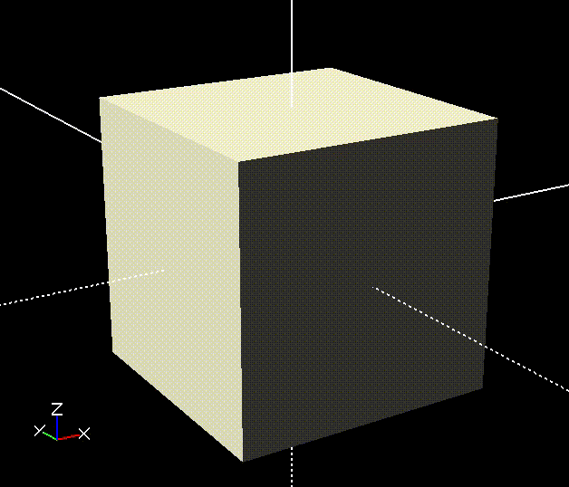

# 3D Cube

A simple implementation of the canvas API and Math trigonometry to build a 3D cube that makes a roation on (x, y, z)

## Preview
<p align="center"></p>

## Useful links

```
https://developer.mozilla.org/en-US/docs/Web/API/Canvas_API
```
```
https://www.instructables.com/Rotating-Cube-Using-JavaScript/
```
```
https://tobiasmarciszko.github.io/rotating-js-cube/
```
```
https://pastel.archives-ouvertes.fr/tel-00596947/document
```