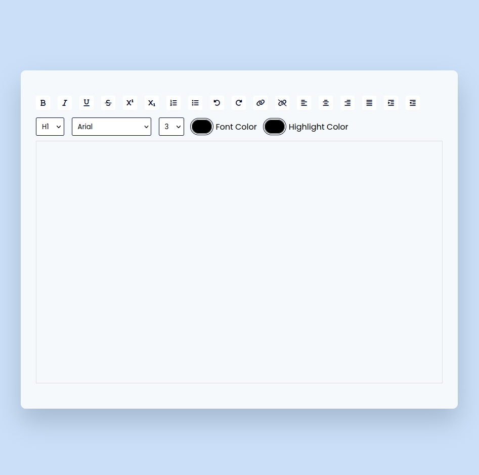
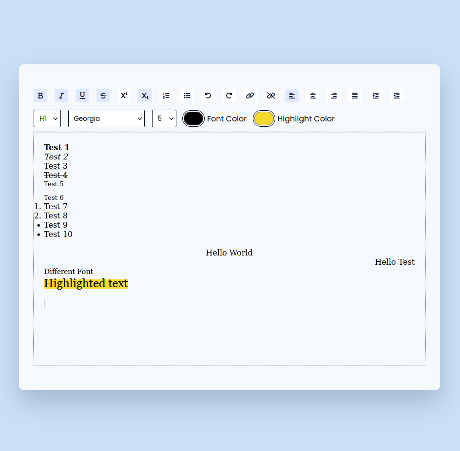

# Rich text editor

The project consists of a text field that the user can type. Above this text field, we have an options section. In the options section, there are a variety of buttons and dropdowns. The user can use these options to modify the text. These options include :
* Text Formatters – Bold, Italic, Underline, Strikethrough.
* List Options – Ordered List, Unordered list.
* Undo and Redo Button.
* Add Link and Remove Link Button.
* Alignment Option Buttons – Align Left, Align Right, Align Center, and Justify.
* Headings Dropdown – H1 To H6.
* Fonts Family Dropdown – 6 Different Fonts.
* Font Size Dropdown – Sizes ranging from 1 to 7.
* Options to change text color and highlight color.

## Project Tree
```
Project
|-- index.html (HTML file)
|-- style.css (CSS file)
|-- app.js (JavaScript file)
|-- preview (folder contains images of the project)
|-- README.md
```

## Preview
<p align="center"></p>
<p align="center"></p>


## Useful links
```
https://developer.mozilla.org/en-US/docs/Web/API/Document/execCommand
```
```
https://developer.mozilla.org/en-US/docs/Web/JavaScript/Reference/Global_Objects/Array/map
```
```
https://fonts.google.com/
```
```
https://fontawesome.com/
```